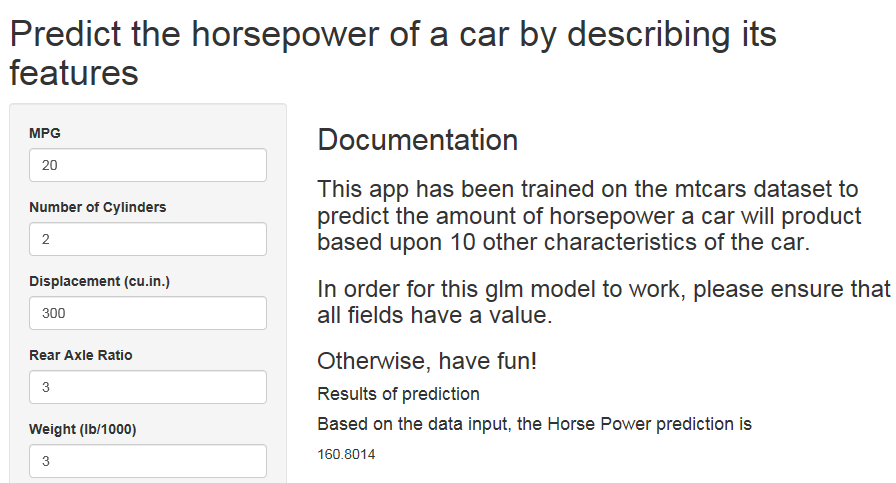

## Introduction

This shiny app feeds in information about a vehicle and outputs a predicted
horse power (hp) value. This is based on a generalized linear model (glm) that
has been trained using the mtcars data. This model will look at relationships
between variables such as one plotted below, in order to suggest the correct hp.

--- .class #id 

## Method

The GLM will be trained to look at the linear relationships between the
independent and dependent variables and calculate the best prediction 
for horsepower. An example of such a relationship is displayed below.

``` {r wt_mpg_plot, echo=FALSE, message=FALSE, fig.height= 6}
require(ggplot2)
qplot(wt, mpg, data = mtcars)
```

---

## Model Information

Here is the information regarding the glm model used. As you can see there are next steps in terms of removing low regession variables but this is a starting point.

```{r modelsummary, echo = TRUE}
model <- glm(hp ~ mpg + cyl + disp + drat + wt + qsec + vs + am + gear + carb, data = mtcars)
summary(model)$coefficients
```

---

## Shiny App

Below is a screenshot of the shiny app hosted on shinapps.io

Simply alter the values in the textboxes and the prediction will refresh automatically.

<p></p>


